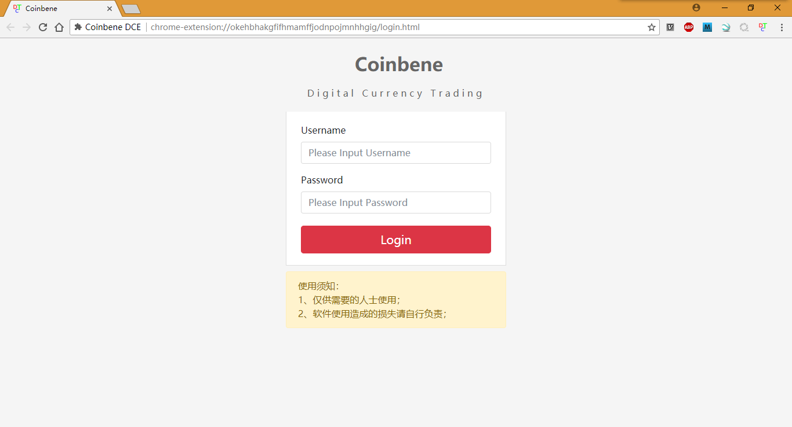

# Coinbene 

目前网络上没有找到针对[Coinbene](http://www.coinbene.com)交易所的Javascript API，所以实现了其HTTP相关的认证，参考信息如下：  
[0.0.0 Coinbene API文档](https://github.com/Coinbene/API-Documents-CHN/wiki/0.0.0-Coinbene-API%E6%96%87%E6%A1%A3)

## Javascript API

* 采用同步HTTP请求，方便每次数据返回进行处理；
* [API Source Code](https://github.com/ZengjfOS/Coinbene/tree/master/js/coinbene)；

### Dependent library

* [jQuery](https://jquery.com/);

### Code Example

#### HTML

```HTML
<!DOCTYPE html>
<html>
  <head>
    <meta http-equiv="Content-Type" content="text/html; charset=utf-8" />
    <meta name="viewport" content="initial-scale=1.0, user-scalable=no" />

    <script type="text/javascript" src="js/libs/md5.min.js"></script>
    <script type="text/javascript" src="js/libs/jquery.min.js"></script>
    <script type="text/javascript" src="js/libs/underscore-min.js"></script>

    <script type="text/javascript" src="js/coinbene/HttpMD5Util.js"></script>
    <script type="text/javascript" src="js/coinbene/CoinbeneSpotAPI.js"></script>
    <script type="text/javascript" src="js/coinbene/Coinbene.js"></script>

    <script type="text/javascript" src="js/main.js"></script>

    <title>Coinbene</title>

  </head>
  <body>

    <div id="main_div">
    </div>

  </body>
</html>
```

#### Javascript

```Javascript
$(function(){
    coinbene = new Coinbene("put your apiid key", "put your secret key");
    Coinbene.setDivMessage("main_div", coinbene.ticker("ziberusdt"));
    Coinbene.setDivMessage("main_div", coinbene.orderbook("ziberusdt"));
    Coinbene.setDivMessage("main_div", coinbene.trades("ziberusdt"));
    Coinbene.setDivMessage("main_div", coinbene.balance());
    Coinbene.setDivMessage("main_div", coinbene.place("ziberusdt", "sell-limit", 10000.00, 1.000));
    Coinbene.setDivMessage("main_div", coinbene.ordersinfo("ziberusdt"));
    Coinbene.setDivMessage("main_div", coinbene.info("S180418185128711694601"));
    Coinbene.setDivMessage("main_div", coinbene.cancel("S180418185128711694601"));
});
```

### Javascript API说明

* `new Coinbene("put your apiid key", "put your secret key")`: [Coinbene](http://www.coinbene.com)账户的`apiid key`和`secret key`；
* `Coinbene.ticker(symbol)`: 获取币币最新交易价；
  * `symbol`: 币币交易类型；
* `Coinbene.orderbook(symbol, depth = 5)`: 获取当前系统挂单；
  * `symbol`: 币币交易类型；
  * `depth`: 市场深度，默认值是买卖方各5个；
* `Coinbene.trades(symbol)`：获取成交记录；
  * `symbol`: 币币交易类型；
* `Coinbene.balance()`：查询账户余额；
* `Coinbene.place(symbol, tradeType, price="", quantity="")`：进行币币交易的买入、卖出；
  * `symbol`: 币币交易类型；
  * `tradetype`: 币币买卖类型；
    * `buy-limit`: 买入；
    * `sell-limit`: 卖出；
  * `price`: 币币交易价格；
  * `quantity`: 币币交易数量；
* `Coinbene.ordersinfo(symbol)`：查询当前所有的委托单；
  * `symbol`: 币币交易类型；
* `Coinbene.info(orderId)`：查询指定的委托单信息；
  * `orderId`: 委托单的订单`id`；
* `Coinbene.cancel(orderId)`：撤销指定的委托单；
  * `orderId`: 委托单的订单`id`；

## Chrome Extension

使用上面提到的[Javascript API](https://github.com/ZengjfOS/Coinbene/tree/master/js/coinbene)进行数据获取，然后进行一些数据分析。


